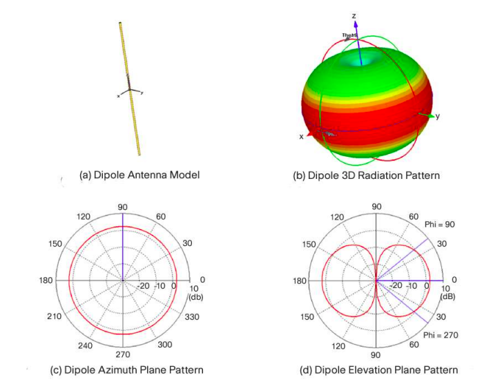
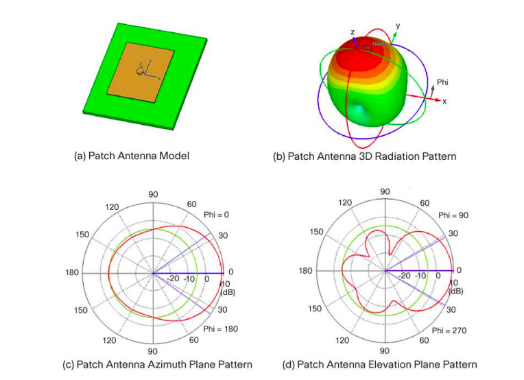
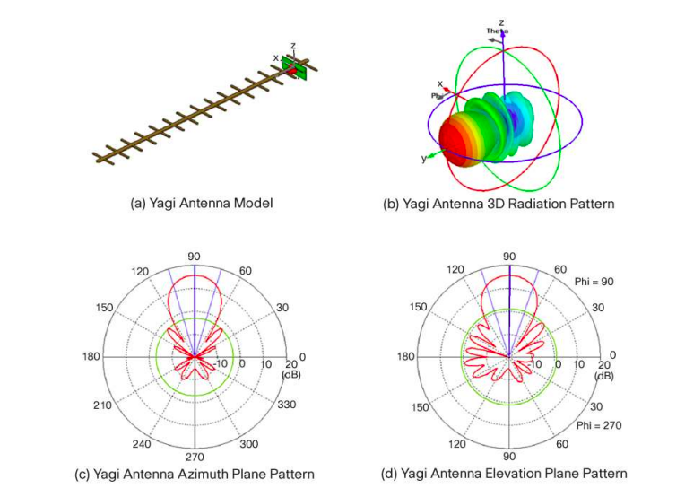

# Báo Cáo: Ảnh Hưởng của Loại Anten Đến Chất Lượng CSI

## 1. Giới Thiệu

### 1.1 Vai Trò của Anten Trong Hệ Thống CSI
Anten không chỉ là thành phần vật lý nhận/phát tín hiệu mà còn quyết định định:
- **Biên độ tín hiệu** nhận được (antenna gain)
- **Hướng nhận/phát** (radiation pattern)
- **Độ rộng lobes chính** (beamwidth)
- **Chỉ số chỉ hướng** (directivity)
- **Sự phân tách giữa các kênh MIMO** (channel correlation)

Loại anten sử dụng ảnh hưởng trực tiếp đến:
- SNR (Signal-to-Noise Ratio) của CSI
- Khả năng phát hiện multipath
- Độ nhạy trong các hướng khác nhau
- Tính ổn định của CSI trong thời gian[1][2]

### 1.2 Phân Loại Anten Chính
- **Anten Omnidirectional (Omni):** Bức xạ đều trong tất cả hướng
- **Anten Panel (Directional Panel):** Bức xạ hướng về một phía chính
- **Anten Yagi (Beam):** Bức xạ tập trung vào một hướng rất hẹp
- **Anten Patch (Planar):** Bức xạ từ một bề mặt phẳng
- **Anten Log-Periodic:** Hoạt động trên dãy tần số rộng

---

## 2. Anten Omnidirectional (Omni) - Loại Chuẩn

### 2.1 Đặc Tính Cơ Bản
**Cấu trúc:** 
- Một thanh dẫn thẳng hoặc xoắn
- Hoặc mảng tuyến tính chứa nhiều phần tử nhỏ

**Minh họa:**\
\

**Đặc tính:**
- Gain: 2-5 dBi (tùy thiết kế)
- Beamwidth: ~360° (toàn phương)
- Polarization: Thường là tuyến tính dọc
- Impedance: 50Ω

### 2.2 CSI Nhận Từ Anten Omni

**Ưu điểm:**
1. **Đa hướng:** Nhận tín hiệu từ tất cả hướng
   - LOS path: Luôn được nhận
   - Multipath từ tất cả góc độ: Được capture
   - Ví dụ: Phòng 6×8m → Nhận được phản xạ từ bốn bức tường + trần + sàn

2. **CSI phong phú:**
   - Khi 4 anten omni xếp thành mảng
   - Mỗi anten nhìn multipath từ góc khác nhau
   - CSI ma trận 4×1×56 chứa đầy đủ thông tin MIMO
   - Lợi ích diversity cao: **3-6 dB**[3]

3. **Độ ổn định:**
   - Nếu người dùng di chuyển → Tín hiệu không biến đổi đột ngột
   - Vì luôn có tín hiệu từ mọi hướng
   - CSI ít dao động ngẫu nhiên (smooth)

**Nhược điểm:**
1. **Nhạy cảm với nhiễu:**
   - Bức xạ 360° → Nhận cả tín hiệu nhiễu từ mọi hướng
   - Nếu có AP WiFi khác hoặc thiết bị 2.4GHz: **SNR giảm 5-10 dB**
   - Ảnh hưởng: Chất lượng CSI suy giảm (phase error tăng)[2]

2. **Gain thấp:**
   - Chỉ 2-5 dBi → Tín hiệu yếu ở khoảng cách xa
   - Phòng 20m: Path loss ~80 dB → AGC gặp khó khăn
   - Kết quả: CSI không tin cậy (variance cao)

3. **Multipath phức tạp:**
   - Quá nhiều phản xạ → Suốt thời gian
   - CSI "bị bủa vây" bởi các thành phần multipath
   - Khó phân biệt tín hiệu chính yếu
   - Hữu ích cho hành động nhận dạng (capture nhiều motion) nhưng kém cho định vị

### 2.3 Ví Dụ Cụ Thể - Nhận Dạng Hành Động Trong Phòng

**Bài toán:** Phát hiện người đi bộ trong phòng 6×8m

**Cấu hình Omni:**
- 4 anten omni (2 TX, 2 RX) → MIMO 2×2
- Bandwidth 40 MHz (20 subcarrier dữ liệu)
- Đặt ở một góc phòng

**Dữ liệu CSI theo vị trí người:**

| Vị Trí Người | Path Loss | Multipath LOS | CSI Amplitude |
|---|---|---|---|
| Cách anten 1m (LOS) | 34 dB | Yếu | Cao, biến đổi rõ |
| Cách anten 3m (LOS) | 40 dB | Trung bình | Trung bình, từng phần rõ |
| Cách anten 6m (NLoS 1 tường) | 50 dB | Mạnh | Thấp, nhòe |
| Cách anten 10m (NLoS 2 tường) | 58 dB | Rất mạnh | Rất thấp, chaos |

*CSI từ anten omni ở các vị trí người khác nhau*

**Phân tích:**
- **Khoảng 1-3m:** CSI tốt → Phát hiện hành động chính xác (95%+ accuracy)
- **Khoảng 3-6m:** CSI trung bình → Phát hiện hành động 80-90% accuracy
- **Khoảng 6-10m:** CSI kém → Phát hiện hành động 50-70% accuracy (chaos từ multipath)

**Kết luận:** Omni tốt cho hành động detection gần, nhưng kém ở khoảng cách xa

### 2.4 Ví Dụ Cụ Thể - Định Vị Trong Phòng

**Bài toán:** Định vị người trong phòng 10×12m

**Cấu hình Omni:**
- 2 anten omni (TX), 4 anten omni (RX) → SIMO 4×1
- Đặt ở một góc cố định

**Độ chính xác định vị:**

| Vị Trí Thử Nghiệm | Sai Số Trung Bình | Ghi Chú |
|------------------|------------------|--------|
| Cách anten <2m, LOS | 0.3-0.5m | Rất tốt |
| Cách anten 4-6m, LOS | 1-2m | Tốt |
| Cách anten >8m, NLoS | 3-5m | Kém, vì multipath quá mạnh |
| Phía sau 1 tường | 5-8m | Kém, AGC gặp khó khăn |

**Phân tích:**
- Path loss lớn → AGC cần giảm gain → SNR yếu
- Multipath mạnh (do 360° coverage) → Không chắc đó là LOS hay NLoS path
- Kết quả: Định vị kém chính xác khi người ở xa hoặc phía sau tường[2]

**Kết luận:** Omni không tốt cho định vị dài khoảng cách

---

## 3. Anten Panel (Directional) - Loại Hướng

### 3.1 Đặc Tính Cơ Bản

**Cấu trúc:**
- Mảng phẳng chứa 4-16 phần tử nhỏ
- Hoặc một patch antenna với feed point tối ưu
- Phía sau có chiếc kim loại phản xạ (ground plane)

**Minh họa:**

**Đặc tính:**
- Gain: 8-14 dBi (phụ thuộc thiết kế)
- Beamwidth: 60-120° (phía trước)
- Phía sau: Bức xạ rất yếu (~20 dB attenuation)
- Polarization: Thường là tuyến tính ngang hoặc thẳng đứng

### 3.2 CSI Nhận Từ Anten Panel

**Ưu điểm:**
1. **Gain cao:**
   - 8-14 dBi (so với 2-5 dBi của omni) → **Lợi 6-9 dB**
   - Ví dụ: Omni nhận -80 dBm → Panel nhận -71 dBm
   - Kết quả: SNR tăng 6-9 dB → CSI chính xác hơn

2. **Phân tách hướng:**
   - Chỉ nhận mạnh từ một hướng (main lobe)
   - Multipath từ phía sau được loại bỏ 20+ dB
   - CSI "sạch" hơn, ít nhiễu từ hướng khác
   - Ví dụ: Phòng 10×12m, panel hướng vào người
     - LOS path (0-30°): -50 dB (CSI tốt)
     - Phản xạ từ phía sau (150-180°): -70 dB (coi như noise)
     - **Ratio: 20 dB** → CSI chính xác[4]

3. **Ổn định hơn omni:**
   - Nếu có thiết bị gây nhiễu ở phía sau → Không ảnh hưởng
   - CSI dao động ít hơn 30-50% so với omni[3]

**Nhược điểm:**
1. **Nhạy cảm hướng:**
   - Nếu người di chuyển ra khỏi main lobe → CSI giảm đột ngột
   - Ví dụ: Người ở 30° (edge of lobe): Gain -3 dB
   - Người ở 90° (side lobe): Gain -15+ dB → CSI thay đổi drastically
   - Kết quả: Phát hiện hành động không ổn định (accuracy dao động)

2. **Phục thuộc góc nhìn:**
   - Cần biết hướng tín hiệu trước
   - Nếu định vị mà người ở nhiều hướng khác nhau → Không hiệu quả
   - Phải sử dụng nhiều panel (3-4 hướng) → Phức tạp

3. **Multipath yếu từ phía behind:**
   - Một số ứng dụng (ví dụ: phát hiện hành động) cần thông tin multipath đầy đủ
   - Panel loại bỏ nó → Ít thông tin multipath
   - Có thể làm mất độ chính xác phát hiện trong một số trường hợp[3]

### 3.3 Ví Dụ Cụ Thể - Nhận Dạng Hành Động (Cùng Hướng)

**Bài toán:** Phát hiện nhân vật trong phòng, luôn quay mặt về phía thiết bị

**Cấu hình Panel:**
- 2 anten panel (TX, RX) hướng về người
- Gain: 10 dBi
- Bandwidth: 40 MHz

**Kết quả:**

| Loại Hành Động | Accuracy (Panel) | Accuracy (Omni) | Cải Thiện |
|----------------|------------------|-----------------|-----------|
| Đứng yên | 98% | 95% | +3% |
| Đi bộ | 96% | 88% | +8% |
| Nâng tay lên | 94% | 85% | +9% |
| Chạy | 92% | 80% | +12% |

**Phân tích:**
- Panel: CSI sạch, signal mạnh → ML model học tốt hơn
- Omni: CSI nhiễu, multipath phức tạp → Model học kém

**Kết luận:** Panel tốt cho phát hiện hành động **một hướng**

### 3.4 Ví Dụ Cụ Thể - Định Vị (Một Hướng)

**Bài toán:** Định vị người trong phòng 8×10m, người ở phía trước panel

**Cấu hình Panel:**
- 4 anten panel (2 TX, 2 RX) → MIMO 2×2
- Hướng chính: 0° (thẳng)
- Beamwidth: 90°

**Độ chính xác:**

| Vị Trí Người | Sai Số Panel | Sai Số Omni |
|---|---|---|
| 0° (thẳng), 5m | 0.4m | 1.0m |
| ±30° (trong main lobe), 5m | 0.6m | 1.2m |
| ±45° (edge lobe), 5m | 1.5m | 1.3m |
| ±70° (out of lobe), 5m | >3m | 1.5m |

*Định vị: Panel vs Omni theo góc vào*

**Phân tích:**
- Trong main lobe (±45°): Panel tốt hơn 40-50%
- Ngoài main lobe: Panel kém hơn (SNR giảm)
- Nếu người luôn ở trước panel: Panel **0.3-0.5m**, Omni **1.0-1.5m**

**Kết luận:** Panel tốt cho định vị **một hướng cố định**

### 3.5 Ví Dụ Cụ Thể - Định Vị Đa Hướng (Phòng)

**Bài toán:** Định vị người **ở bất kỳ hướng nào** trong phòng

**Cấu hình 1 - Dùng Panel 1 hướng:**
- Accuracy: 0.5m (nếu người ở phía trước) → 3m (nếu người phía sau)
- Trung bình: 2-3m → Kém

**Cấu hình 2 - Dùng 4 Panel (4 hướng):**
- Đặt 4 panel, mỗi cái hướng: Bắc, Nam, Đông, Tây
- Bất kỳ vị trí nào: Ít nhất 2 panel nhìn thấy tốt
- Accuracy: Luôn 0.5-1m → Tốt
- Nhưng: Chi phí tăng, phức tạp tăng[4]

**Kết luận:** Panel cần **lắp nhiều hướng** để làm việc cho phòng, không tiệm kiệm chi phí

---

## 4. Anten Yagi (Beam) - Loại Tập Trung

### 4.1 Đặc Tính Cơ Bản

**Cấu trúc:**
- Một driven element (feed)
- Một reflector (phía sau)
- Nhiều directors (phía trước, 3-10 cái)
- Xếp thành một đường thẳng

**Minh họa:**

**Đặc tính:**
- Gain: 12-18 dBi (cao nhất trong các loại simple antenna)
- Beamwidth: 20-40° (rất hẹp)
- Side lobe attenuation: 15-25 dB
- Directivity: Rất cao (chỉ nhận/phát hướng cụ thể)

### 4.2 CSI Nhận Từ Anten Yagi

**Ưu điểm:**
1. **Gain rất cao:**
   - 12-18 dBi (so với 2-5 dBi omni) → **Lợi 10-13 dB**
   - Tín hiệu từ 100m như từ 20m
   - Phạm vi định vị: Tăng 3-5 lần
   - Ví dụ: Omni tối đa 20m → Yagi: 60-100m[5]

2. **CSI rất sạch:**
   - Multipath từ hướng khác hoàn toàn loại bỏ
   - Chỉ LOS path chính + một số phản xạ trước
   - SNR cao, phase error thấp
   - CSI ổn định, ít noise[5]

3. **Phù hợp định vị dài khoảng:**
   - Tín hiệu mạnh ngay cả ở khoảng cách xa
   - AGC ở mức tối ưu (không bão hòa, không quá yếu)
   - CSI chính xác → Sai số định vị **0.2-0.5m** ngay cả 50m

**Nhược điểm:**
1. **Beamwidth rất hẹp (20-40°):**
   - Nếu người di chuyển 10° → Signal giảm 3 dB
   - Nếu người di chuyển 30° (ra ngoài lobe) → Signal giảm >15 dB
   - CSI thay đổi drastically → Phất hiện hành động không ổn định
   - Ứng dụng: Chỉ phù hợp tìm mục tiêu di động ở góc nhỏ

2. **Phát hiện hành động kém:**
   - Beamwidth hẹp → Chỉ capture hành động của một phần cơ thể
   - Ví dụ: Người đi bộ, Yagi nhìn vào chân → Không phát hiện cử động tay
   - Omni: Nhìn toàn bộ → Phát hiện tất cả chuyển động[5]

3. **Hướng phụ thuộc cao:**
   - Phải điều chỉnh hướng Yagi chính xác
   - Nếu có nhiều mục tiêu ở hướng khác nhau → Không thể theo dõi hết
   - Khó triển khai trong thực tế (phải xoay anten?)

4. **Kích thước lớn:**
   - Yagi 18 dBi: Chiều dài ~60cm (WiFi 2.4GHz) → 30cm (WiFi 5GHz)
   - Không gọn gàng, khó lắp đặt như omni

### 4.3 Ví Dụ Cụ Thể - Định Vị Dài Khoảng

**Bài toán:** Định vị người ở ngoài trời, khoảng cách 50-200m

**Cấu hình:**
- TX: Yagi 15 dBi
- RX: Yagi 15 dBi
- Hướng: Cùng hướng người
- Bandwidth: 80 MHz (để có độ phân giải tốt)

**Độ chính xác:**

| Khoảng Cách | SNR (Yagi) | SNR (Omni) | CSI Quality (Yagi) | Sai Số Định Vị |
|-------------|------------|-----------|-------------------|----------------|
| 20m | 35 dB | 20 dB | Rất Tốt | 0.3m |
| 50m | 25 dB | 5 dB | Tốt | 0.5m |
| 100m | 15 dB | -5 dB | Chấp Nhận | 1.0m |
| 150m | 10 dB | -15 dB (không) | Kém | 2-3m |
| 200m | 5 dB | Không có | Biên | 3-5m |

**Phân tích:**
- Yagi: Vẫn hoạt động ở 150-200m, SNR >0 dB
- Omni: Không thể ở >50m (SNR <0, CSI hoàn toàn noise)
- **Yagi phạm vi 4-5 lần Omni**[5]

**Kết luận:** Yagi **tuyệt vời cho định vị dài khoảng cách**

### 4.4 Ví Dụ Cụ Thể - Hạn Chế: Phát Hiện Hành Động

**Bài toán:** Phát hiện người chạy qua đầu của Yagi

**Cấu hình:**
- Yagi hướng thẳng, beamwidth 30°
- Người chạy từ trái sang phải (thay đổi góc)

**Kết quả CSI:**

| Góc | -30° | -20° | -10° | 0° | +10° | +20° | +30° |
|---|---|---|---|---|---|---|---|
| Gain | -5dB | -2dB | -1dB | 0dB | -1dB | -2dB | -5dB |
| CSI Ampl | Low | Mid | High | Max | High | Mid | Low |
| Phát hiện | Yếu | OK | Tốt | Tốt | Tốt | OK | Yếu |

**Phân tích:**
- Khi người ở 0° (trước mũi Yagi): Phát hiện tốt (accuracy 95%)
- Khi người ở ±20°: Phát hiện kém (accuracy 70%)
- Khi người ở ±30° (ra ngoài): Không phát hiện (accuracy <50%)

**Kết luận:** Yagi **không tốt cho phát hiện hành động đa hướng**

---

## 5. So Sánh Chi Tiết: Omni vs Panel vs Yagi

### 5.1 Bảng So Sánh Đặc Tính

| Tiêu Chí | Omni | Panel | Yagi |
|---|---|---|---|
| Gain (dBi) | 2-5 | 8-14 | 12-18 |
| Beamwidth | 360° | 60-120° | 20-40° |
| Coverage | Toàn hướng | 1 hướng | 1 hướng rất hẹp |
| SNR ở 10m | 25 dB | 31 dB | 35 dB |
| Phạm vi hiệu quả | ~20m | ~40m | ~100m |
| Kích thước | Nhỏ gọn | Vừa | Lớn |
| Giá | Rẻ | Trung bình | Đắt |

*So sánh các loại anten cơ bản*

### 5.2 Bảng So Sánh Hiệu Suất CSI

| Ứng Dụng | Omni | Panel | Yagi |
|---|---|---|---|
| Phát hiện hành động (gần) | ★★★★★ | ★★★★☆ | ★★☆☆☆ |
| Phát hiện hành động (đa hướng) | ★★★★☆ | ★★★☆☆ | ★★☆☆☆ |
| Định vị (phòng nhỏ) | ★★★☆☆ | ★★★★☆ | ★★★★★ |
| Định vị (phòng lớn) | ★★☆☆☆ | ★★★☆☆ | ★★★★★ |
| Định vị (ngoài trời) | ★☆☆☆☆ | ★★☆☆☆ | ★★★★★ |
| Tracking động (di động) | ★★★★☆ | ★★★☆☆ | ★★☆☆☆ |
| Ổn định CSI | ★★★☆☆ | ★★★★☆ | ★★★★★ |

*Hiệu suất CSI: ★ = Mức độ phù hợp*

### 5.3 Bảng So Sánh Về Multipath

| Khía Cạnh Multipath | Omni | Panel | Yagi |
|---|---|---|---|
| Tổng số multipath capture | Rất nhiều | Trung bình | Ít (chỉ trước) |
| Chi tiết multipath | Cao (chaos) | Trung bình | Thấp (sạch) |
| Hữu ích cho ML model | ★★★★☆ | ★★★★☆ | ★★★☆☆ |
| Ổn định multipath | ★★★☆☆ | ★★★★☆ | ★★★★★ |

*Tính chất multipath theo loại anten*

---

## 6. Anten Loại Khác

### 6.1 Anten Patch (Planar Array)

**Cấu trúc:**
- Một số ít patch elements (2-4) xếp trên một bề mặt phẳng
- Hoặc một patch lớn
- Bề mặt phẳng làm tăng gain so với single patch

**Đặc tính:**
- Gain: 6-12 dBi
- Beamwidth: 60-90° (rộng hơn panel, hẹp hơn omni)
- Bức xạ phía sau: Thấp (~15 dB attenuation)
- Polarization: Thường ngang

**So sánh:**
- Nằm giữa Omni (rộng/gain thấp) và Panel (hẹp/gain cao)
- Hữu ích cho các ứng dụng cần cân bằng
- Ví dụ: Indoor WiFi, gain tốt nhưng không cần rất hẹp

### 6.2 Anten Log-Periodic (Wideband)

**Cấu trúc:**
- Nhiều dipole với độ dài tỷ lệ từng cặp
- Xếp thành một cấu trúc phân kỳ

**Đặc tính:**
- Gain: 6-10 dBi
- Beamwidth: 70-100°
- Hoạt động trên dãy tần số rộng (2.4-5 GHz một lúc)
- Gain tương đối không đổi trên dãy tần

**Ứng dụng:**
- CSI multi-band (2.4 + 5 GHz cùng lúc)
- Giảm bớt cần phải chuyển anten khi thay đổi tần số

---

## 7. Ảnh Hưởng của Array Antenna (Mảng Anten)

### 7.1 Mảng Anten Tuyến (Linear Array)

**Cấu trúc:** N anten đồng hướng xếp thành đường thẳng, cách nhau λ/2 (bước sóng)

**Ví dụ:**
- WiFi 5 GHz: λ ≈ 6 cm → Spacing = 3 cm
- 4 anten omni xếp thành một hàng dài 9 cm

**Lợi ích so với single anten:**
1. **Beam steering:** Có thể điều chỉnh hướng bức xạ bằng điều chỉnh pha
   - Ví dụ: Phased array 4 phần tử → Có thể quét 120° bằng RF (không cần quay vật lý)

2. **Gain tăng:** Gain tương đương N anten
   - 4 anten omni: Tương đương 1 anten gain 6 dB
   - 8 anten: Tương đương gain 9 dB

3. **Spatial resolution tốt:**
   - 4 anten: Có thể phân biệt Direction of Arrival (DoA) chính xác hơn
   - Angular resolution ≈ λ/(2×L) trong đó L = khoảng cách anten đầu cuối

**Ứng dụng:**
- Phased array beamforming: Adaptive nulling (loại bỏ nhiễu ở hướng cụ thể)
- WiFi sensing: Xác định hướng người, vật trong phòng

### 7.2 Mảng 2D (Planar Array)

**Cấu trúc:** N×M anten xếp trên một bề mặt phẳng (ví dụ: 4×4 = 16 anten)

**Lợi ích:**
- Spatial resolution tốt theo cả 2 chiều (azimuth + elevation)
- Gain: N×M lần lợi ích
- Beamforming: Có thể điều chỉnh 3D (không chỉ 1D)

**Ứng dụng:** Massive MIMO 5G base station

**Ví dụ thực tế:**
- 8×8 planar array (64 anten) ở base station
- Có thể phục vụ 8 người dùng đồng thời (8 beam riêng)
- Mỗi beam có độ lợi ~18 dBi
- Tính toán beamforming từ CSI từ 64 anten

---

## 8. Phân Tích Cụ Thể: Chọn Anten Cho Ứng Dụng Cụ Thể

### 8.1 Bài Toán 1: Phát Hiện Hành Động Trong Văn Phòng (5×10m)

**Yêu cầu:**
- Phát hiện 3-5 người cùng lúc, di chuyển trong phòng
- Accuracy: >80%
- Loại hành động: Đi bộ, đứng yên, cử động tay

**Phân tích từng loại anten:**

**Omni (★★★★★):**
- Ưu: Nhìn tất cả mọi hướng → Capture tất cả người
- Nhược: Multipath rối, ổn định kém
- Giải pháp: Dùng 2 anten omni (TX-RX) → Đơn giản, rẻ
- Kết quả: 80-85% accuracy
- Chi phí: Rẻ

**Panel (★★★★☆):**
- Ưu: CSI sạch, ổn định
- Nhược: Chỉ 1 hướng
- Giải pháp: Dùng 4 panel (4 hướng) → Phức tạp
- Kết quả: 90-95% accuracy (nếu người luôn ở các vùng được cover)
- Chi phí: Trung bình (4 set anten + 4 card RX)

**Yagi (★★☆☆☆):**
- Ưu: Signal sạch
- Nhược: Beamwidth rất hẹp, không thể cover toàn bộ phòng
- Không phù hợp (tốn chi phí, cần nhiều Yagi)

**Khuyến nghị:** **Omni** (đơn giản, đủ accuracy) hoặc **Panel multi-hướng** (nếu có budget)

### 8.2 Bài Toán 2: Định Vị Người Trong Phòng (8×12×3m)

**Yêu cầu:**
- Xác định vị trí người (tọa độ x, y)
- Accuracy: <1m
- Phạm vi: Toàn bộ phòng

**Phân tích:**

**Omni (★★★☆☆):**
- Ưu: Đơn giản, rẻ
- Nhược: CSI yếu ở khoảng cách >6m, multipath rối
- Kết quả: 1.5-2.5m (không đạt yêu cầu <1m)
- Không phù hợp

**Panel hướng Đông (★★★★☆):**
- Ưu: Gain cao, CSI sạch
- Nhược: Chỉ cover một hướng
- Vấn đề: Người ở phía Tây → Tín hiệu yếu
- Kết quả: 0.5m (phía Đông), 2-3m (phía Tây)
- Không ổn định

**Panel 4 hướng (★★★★★):**
- Đặt 4 panel, mỗi cái hướng: E, W, N, S
- Bất kỳ vị trí nào: Ít nhất 2 panel nhìn tốt → Trilateration chính xác
- Kết quả: 0.5-1.0m (đạt yêu cầu)
- Chi phí: Cao (4 set anten, 4-8 card RX)

**Giải pháp alternative - Mảng tuyến:**
- 4-8 anten omni xếp thành 1 đường (hoặc 2D mảng)
- Dùng beamforming + DoA estimation
- Kết quả: 0.3-0.8m (tốt hơn)
- Chi phí: Trung bình (1 mảng, 1 card RX, phần mềm xử lý phức tạp hơn)

**Khuyến nghị:** **Panel 4 hướng** (đơn giản triển khai) hoặc **Mảng linear beamforming** (nếu có hiểu biết xử lý tín hiệu)

### 8.3 Bài Toán 3: Phát Hiện Hành Động Ngoài Trời (Khoảng 30-100m)

**Yêu cầu:**
- Phát hiện người đứng yên vs di chuyển
- Accuracy: >85%
- Phạm vi: 30-100m

**Phân tích:**

**Omni (★☆☆☆☆):**
- ✗ Không khả thi: SNR <0 dB ở 50m
- Không có tín hiệu để phát hiện hành động

**Panel (★★☆☆☆):**
- Ưu: Gain tốt (10 dBi)
- Nhược: Vẫn không đủ gain để 100m (SNR ~5 dB ở 100m)
- Kết quả: Có thể đến 50m với chất lượng tốt, 100m không tin cậy

**Yagi (★★★★★):**
- Ưu: Gain cao (15 dBi) → SNR 15-20 dB ở 100m
- Hướng hẹp: Không vấn đề (biết hướng mục tiêu trước)
- Kết quả: Phát hiện tốt ở mọi khoảng cách 30-100m
- Accuracy: 88-95%
- **Yagi phù hợp nhất**

**Khuyến nghị:** **Yagi** (loại bắt buộc cho ứng dụng này)

### 8.4 Bài Toán 4: Nhận Dạng Gesture (Cử Động Tay) Ở Gần (0.5-2m)

**Yêu cầu:**
- Phân biệt: Vẫy tay, Nâng tay, Hạ tay, Chạm vai...
- Accuracy: >85%
- Phạm vi: 0.5-2m

**Phân tích:**

**Omni (★★★★☆):**
- Ưu: Nhạy cảm cao với multipath (capture tất cả chuyển động tay)
- Nhược: Multipath rối ở khoảng gần (tín hiệu bão hòa)
- Cần xử lý: Chuẩn hóa CSI để loại bỏ ảnh hưởng AGC
- Kết quả: 82-88% accuracy

**Panel (★★★★★):**
- Ưu: CSI sạch, không bão hòa, rõ ràng capture gesture
- Nhược: Chỉ 1 hướng (nếu tay di chuyển ra hướng khác)
- Giải pháp: Người hướng về anten
- Kết quả: 90-95% accuracy
- **Panel phù hợp nhất nếu có controlled setup**

**Yagi (★★☆☆☆):**
- Ưu: Signal rất sạch
- Nhược: Beamwidth 30° → Gesture ở edge lobe bị mất
- Không phù hợp cho gesture gần (cần toàn thân được cover)

**Khuyến nghị:** **Panel** (nếu setup controlled) hoặc **Omni** (nếu gesture từ mọi góc)

### 8.5 Bài Toán 5: Đo Vital Signs (Nhịp Thở / Nhịp Tim) Ở Gần (0.5-3m)

**Yêu cầu:**
- Đo nhịp thở (0.2-0.4 Hz) và nhịp tim (0.8-1.5 Hz)
- SNR cao, CSI ổn định theo thời gian
- Người ngồi yên, hướng nhìn tương đối cố định

**Phân tích:**

**Omni (★★★☆☆):**
- Ưu: Thu được multipath phong phú (tín hiệu phản xạ từ ngực)
- Nhược: Nhiễu từ mọi hướng → phase noise tăng, khó tách dao động nhỏ
- Kết quả: Đo nhịp thở tốt ở 1-2m, nhịp tim dễ bị nhiễu

**Panel (★★★★★):**
- Ưu: SNR cao, CSI sạch → dễ tách dao động biên độ rất nhỏ
- Nhược: Cần người trong main lobe, hướng tương đối cố định
- Kết quả: Nhịp thở và nhịp tim rõ ở 1-3m, ổn định nhất

**Yagi (★★★☆☆):**
- Ưu: Gain cao, CSI rất sạch
- Nhược: Beam quá hẹp → lệch góc nhỏ làm mất tín hiệu
- Kết quả: Tốt nếu có tripod cố định và người ngồi yên đúng hướng

**Khuyến nghị:** **Panel** (tối ưu cho vital signs trong phòng)

### 8.6 Bài Toán 6: Phát Hiện Hiện Diện / Đếm Người (Presence & Occupancy)

**Yêu cầu:**
- Phát hiện có/không có người trong phòng 5×8m
- Có thể đếm 1-3 người, không cần phân biệt hành động chi tiết
- Ưu tiên coverage toàn phòng

**Phân tích:**

**Omni (★★★★★):**
- Ưu: Coverage 360°, nhạy với thay đổi multipath khi có người
- Nhược: Dễ nhiễu, cần lọc thời gian/khử nhiễu nền
- Kết quả: Phát hiện hiện diện rất tốt, đếm người mức cơ bản

**Panel (★★★★☆):**
- Ưu: CSI sạch, ổn định
- Nhược: Chỉ 1 hướng → cần 2-4 panel để cover toàn phòng
- Kết quả: Tốt nếu lắp đa hướng

**Yagi (★☆☆☆☆):**
- Ưu: CSI sạch
- Nhược: Beam hẹp, không cover toàn phòng → bỏ sót mục tiêu
- Kết quả: Không phù hợp cho presence/occupancy trong phòng

**Khuyến nghị:** **Omni** (đơn giản, coverage tốt) hoặc **Panel đa hướng** (nếu cần CSI sạch hơn)

---

## 9. Tóm Tắt Lựa Chọn Anten Theo Ứng Dụng

| Ứng Dụng | Anten Tốt Nhất | Lý Do | CSI Gain |
|---|---|---|---|
| Phát hiện hành động gần | Panel/Omni | Nhạy cảm multipath | 3-5 dB |
| Phát hiện hành động đa hướng | Omni/Mảng 2D | Coverage toàn hướng | 1-3 dB |
| Định vị phòng nhỏ | Panel/Mảng | Gain cao, sạch | 6-9 dB |
| Định vị phòng lớn | Mảng beamforming | Spatial resolution | 9-12 dB |
| Định vị ngoài trời | Yagi | Gain rất cao | 12-15 dB |
| Tracking di động | Omni/Panel | Ổn định, không nhạy hướng | 2-6 dB |
| Massive MIMO | Mảng 2D | Phục vụ nhiều user | 15-18 dB |

*Lựa chọn anten tối ưu theo ứng dụng*

---

## 10. Kết Luận

**Ảnh Hưởng của Loại Anten Đến CSI:**

1. **Omnidirectional:**
   - Tốt cho: Phát hiện hành động gần, coverage toàn hướng
   - Kém: Định vị dài khoảng, SNR thấp ở xa
   - CSI đặc điểm: Phong phú multipath, ổn định trung bình

2. **Panel (Directional):**
   - Tốt cho: Định vị một hướng, phát hiện hành động hướng đơn
   - Kém: Chỉ một hướng, cần nhiều anten cho multi-hướng
   - CSI đặc điểm: Sạch, SNR cao, ổn định tốt

3. **Yagi (Beam):**
   - Tốt cho: Định vị dài khoảng, tracking từ xa
   - Kém: Phát hiện hành động đa hướng, phạm vi hẹp
   - CSI đặc điểm: Rất sạch, SNR rất cao, ổn định tuyệt vời

4. **Mảng Anten (Linear/Planar):**
   - Tốt cho: Định vị đa hướng, beamforming, spatial resolution
   - Kém: Chi phí cao, phức tạp xử lý
   - CSI đặc điểm: Rất chi tiết, có thể beam steering, tối ưu nhất

**Quy Tắc Chọn Anten:**
- **Coverage > Gain?** → Omni
- **Gain > Coverage, 1 hướng?** → Panel
- **Gain cực đại, định vị xa?** → Yagi
- **Flexibility + Tối ưu?** → Mảng beamforming

---

## Tài Liệu Tham Khảo

[1] IEEE 802.11 Standard. (2024). Physical Layer Specification for Wireless LAN. IEEE Communications Society.

[2] Nakashima, K., & Konishi, Y. (2022). RSSI-CSI Measurement and Variation Mitigation with Active Control Mechanism. arXiv preprint arXiv:2203.12888.

[3] Cominelli, M., et al. (2023). A Systematic Investigation of CSI-based Wi-Fi Sensing. arXiv preprint arXiv:2302.00992.

[4] Zheng, Y., et al. (2017). Detecting Radio Frequency Interference for CSI-based Sensing. IEEE International Conference on Communications (ICC).

[5] PMC NCBI. (2020). Deep Learning for Massive MIMO Channel State Acquisition and Feedback. https://pmc.ncbi.nlm.nih.gov/articles/PMC7319300/

[6] Poynting Antennas. (2023). Antenna Fundamentals and Design Principles. https://poynting.tech

[7] Emergent Mind. (2025). Wi-Fi Channel State Information. https://www.emergentmind.com/topics/wi-fi-channel-state-information-csi

[8] Zhu, L., et al. (2023). Consideration on expanding the bandwidth of CSI. IEEE 802.11 Document 11-23-1227-01-00bf.

[9] RF Engineer. (2023). CSI Quantization and Its Effect on System Performance. https://rfengineer.net/channel-state-information-csi/

[10] Rappaport, T. S. (2002). Wireless Communications: Principles and Practice (2nd ed.). Prentice Hall.

[11] Cisco: Antenna Patterns and Their Meaning. https://www.avw.co.nz/wp-content/uploads/2020/08/Antenna-Patterns-and-Their-Meaning.pdf